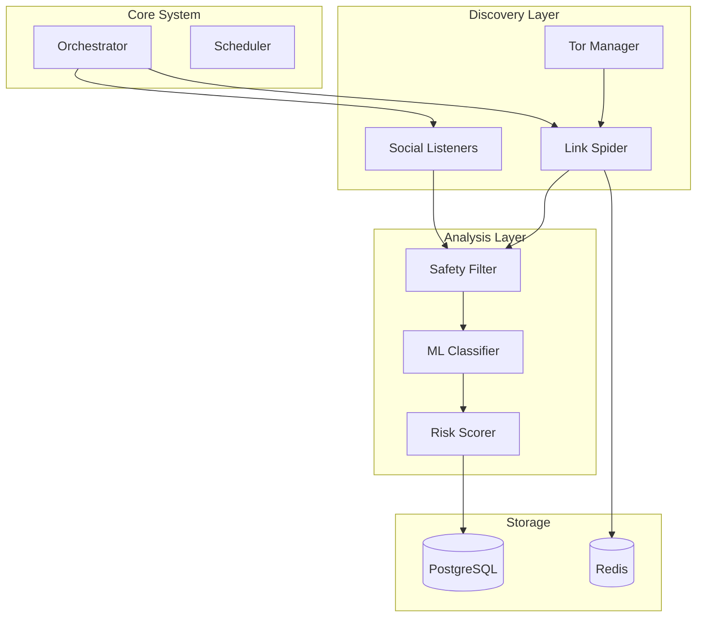

<div align="center">

# 🕷️ Arachne
### Autonomous Dark Web Discovery & Classification System

[](https://www.python.org/downloads/)
[](https://www.gnu.org/licenses/gpl-3.0)
[](https://www.docker.com/)
[](https://github.com/psf/black)

*The all-seeing scout for legitimate cybersecurity research and threat intelligence.*

[Features](#key-features) • [Installation](#installation) • [Usage](#usage) • [Configuration](#configuration) • [API](#api)

</div>

---

> [!IMPORTANT]
> **LEGAL DISCLAIMER**: This software is designed for **LEGITIMATE SECURITY RESEARCH ONLY**. 
> - Users are solely responsible for compliance with all applicable local, state, and international laws. 
> - The developers assume **NO LIABILITY** for misuse or damage caused by this software.
> - Always operate within an isolated, sandboxed environment (air-gapped recommended).

---

## 📖 Overview

**Arachne** is an enterprise-grade, autonomous intelligence system designed to discover, classify, and monitor hidden services on the Tor network. It combines advanced crawling capabilities with machine learning-based content classification to identify potential threats, illicit marketplaces, and high-risk content while maintaining strict operational security.

Unlike simple crawlers, Arachne focuses on **safety**, **stealth**, and **intelligence**, using advanced circuit rotation and user-agent spoofing to avoid detection while processing content through a robust safety pipeline.

## 🚀 Key Features

### 🕵️‍♂️ Autonomous Discovery
*   **Deep Web Crawling**: Recursively discovers .onion sites with configurable depth and concurrency.
*   **Social Listening**: (Optional) Monitors Telegram, IRC, and Twitter for new dark web links.
*   **Stealth Operation**: Automatic Tor circuit rotation, user-agent randomization, and behavior mimicking to avoid anti-bot detection.

### 🧠 Advanced Classification
*   **Safety Pipeline**: Pre-screens content for illegal material using hash matching and pattern recognition before human review.
*   **ML-Powered Categorization**: Automatically classifies sites into categories (e.g., Marketplaces, Forums, Ransomware) using NLP.
*   **Risk Scoring**: Calculates a dynamic risk score (0-100) based on content analysis, hosting patterns, and historical data.

### 🛡️ Operational Security
*   **Air-Gap Mode**: Option to run in a restricted mode that prevents leakage of sensitive data.
*   **Metadata Stripping**: Automatically removes dangerous metadata from collected artifacts.
*   **Honeypot Detection**: Identifies known law enforcement or researcher honeypots to avoid false positives.

### 📊 Infrastructure
*   **Scalable Architecture**: Built on **FastAPI**, **PostgreSQL**, and **Redis** for high performance.
*   **REST API**: Full programmatic access to all data and control functions.
*   **Monitoring**: Integrated health checks for Tor connections, database status, and system resources.

## 🏗️ Architecture



## 🛠️ Installation

### Prerequisites
*   **Python 3.10+**
*   **Tor** (via `apt install tor` or equivalent)
*   **PostgreSQL** & **Redis**

### Option A: Docker (Recommended)
The easiest way to get up and running is with Docker Compose.

```bash
# Clone the repository
git clone https://github.com/MasterCaleb254/arachne.git
cd arachne

# Launch services
docker-compose up -d --build
```

### Option B: Manual Installation

1.  **Clone and Install Dependencies**:
    ```bash
    git clone https://github.com/MasterCaleb254/arachne.git
    cd arachne
    pip install -e .
    ```

2.  **Configure Environment**:
    ```bash
    cp .env.example .env
    # Update .env with your DB credentials and Tor password
    ```

3.  **Start Infrastructure**:
    Ensure PostgreSQL, Redis, and Tor are running locally.

4.  **Initialize Database**:
    ```bash
    python -m src.cli.main db init
    ```

## 💻 Usage

Arachne provides a powerful CLI for all operations.

### Quick Start
```bash
# 1. Initialize the database
python -m src.cli.main db init

# 2. Start a discovery run using default seeds
python -m src.cli.main discover start --mode crawl --depth 2

# 3. Start the API server
python -m src.cli.main api serve
```

### Discovery Commands
Manage the crawling and harvesting process.

```bash
# tailored discovery with specific seed file
python -m src.cli.main discover start --seeds configs/seeds/custom.txt --limit 500

# View current discovery status
python -m src.cli.main discover status

# Test crawl a single URL to verify reachability
python -m src.cli.main discover test-crawl --url http://example.onion
```

### Classification Commands
Run the analysis pipeline on discovered sites.

```bash
# Batch classify 100 pending sites
python -m src.cli.main classify run --batch --limit 100

# Show high-risk sites (Critical/High)
python -m src.cli.main classify risky --risk-level critical

# Test illegal content patterns against a text string
python -m src.cli.main classify test-patterns --patterns-file configs/illegal_patterns.txt
```

### System Monitoring
Check the health of your scout.

```bash
# View system resource usage and DB stats
python -m src.cli.main monitor status

# Start a continuous health monitor
python -m src.cli.main monitor health --interval 60
```

## ⚙️ Configuration

Configuration is managed via `configs/default.yaml`. You can override these settings using environment variables or a custom YAML file.

| Section | Key | Description |
|---------|-----|-------------|
| **Tor** | `socks_port` | Local Tor SOCKS port (default: 9050) |
| **Discovery** | `max_depth` | How deep to crawl from seed URLs |
| **Discovery** | `concurrent_requests` | Max parallel requests to avoid congestion |
| **Safety** | `air_gap_mode` | If true, prevents external internet access |
| **Safety** | `illegal_content_filter` | 'strict' or 'loose' filtering logic |
| **ML** | `confidence_threshold` | Minimum score (0.0-1.0) to accept a classification |

## 🔌 API

Arachne exposes a full REST API for integration with dashboards or other tools.

-   **Development URL**: `http://localhost:8000`
-   **Documentation (Swagger)**: `http://localhost:8000/docs`

**Endpoints include:**
-   `GET /sites`: List discovered sites with filters.
-   `POST /scan`: Trigger a scan for a specific URL.
-   `GET /stats`: System-wide statistics.

## 🧪 Development

To run the test suite:

```bash
# Run all tests
pytest

# Run specific test group
pytest tests/integration/test_full_pipeline.py
```

## 📄 License

This project is licensed under the **GNU General Public License v3.0** - see the LICENSE file for details.

---

<div align="center">
    <sub>Built with ❤️ by the Dark Web Research Team</sub>
</div>
